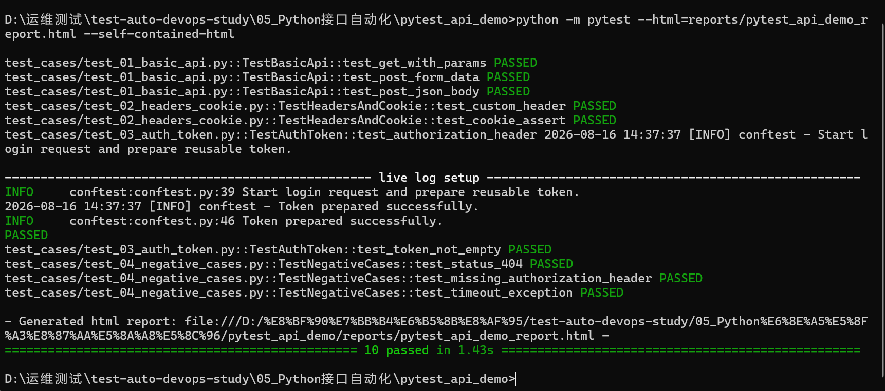
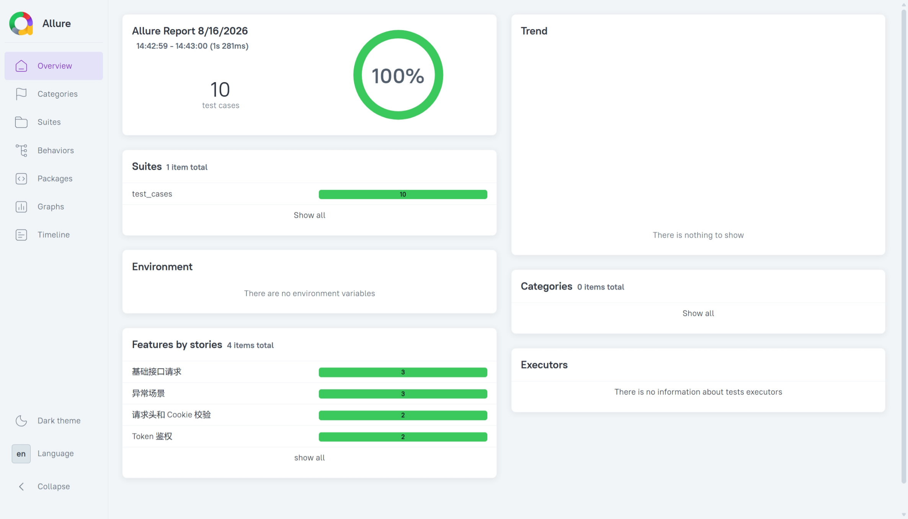
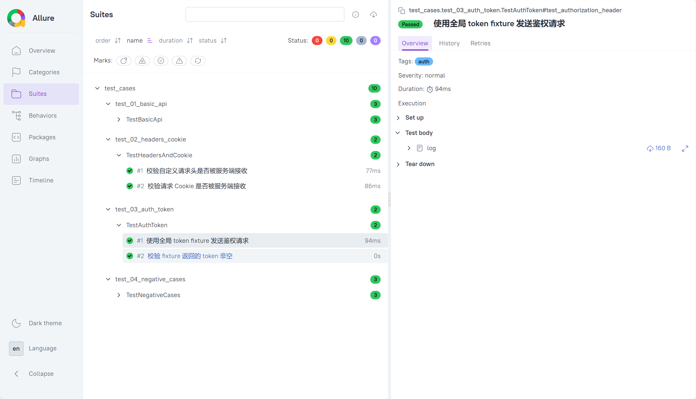

# pytest_api_demo 接口自动化项目

> 这是一个面向运维测试学习阶段的轻量级 pytest 接口自动化 demo，重点练习 `requests`、断言、fixture、Token 复用、请求头/Cookie 校验、异常场景和测试报告生成。

## 项目结构

```text
pytest_api_demo/
├── conftest.py              # pytest 公共配置和 fixture
├── pytest.ini               # pytest 执行配置
├── requirements.txt         # 项目依赖
├── README.md                # 项目说明
├── common/
│   └── logger.py            # 简单日志工具
├── docs/
│   ├── images/              # 测试执行截图和 Allure 截图
│   ├── reports/             # 可下载查看的 pytest-html 报告
│   └── 测试报告与截图说明.md
└── test_cases/
    ├── test_01_basic_api.py       # GET / POST 基础请求
    ├── test_02_headers_cookie.py  # 请求头和 Cookie 断言
    ├── test_03_auth_token.py      # fixture 获取 token 并复用
    └── test_04_negative_cases.py  # 异常场景与错误响应
```

## 覆盖知识点

- GET 无参 / 带参数请求
- POST 表单 / JSON 请求体
- 状态码断言
- 返回字段断言
- 请求头断言
- Cookie 断言
- `pytest.fixture` 前置准备
- 全局 Token 复用
- 异常状态码校验
- 简单日志输出
- HTML / Allure 报告生成

## 安装依赖

```bash
pip install -r requirements.txt
```

## 运行全部用例

```bash
pytest
```

## 生成 pytest-html 报告

```bash
pytest --html=reports/report.html --self-contained-html
```

本项目已归档一份 pytest-html 报告，可下载后用浏览器打开：

[pytest_api_demo_report.html](./docs/reports/pytest_api_demo_report.html)

## 生成 Allure 报告

先生成 Allure 原始结果：

```bash
pytest --alluredir=allure-results
```

再生成 HTML 报告：

```bash
allure generate allure-results -o allure-report --clean
```

打开报告：

```bash
allure open allure-report
```

## 测试报告截图

### pytest 终端执行结果



### pytest-html 报告摘要


### Allure 报告总览



### Allure Suites 分类


### Token 鉴权用例详情



更详细的截图说明见：[测试报告与截图说明](./docs/测试报告与截图说明.md)。

## 测试环境说明

默认请求地址：

```text
https://httpbin.ceshiren.com
```

也可以通过环境变量覆盖：

```bash
set API_BASE_URL=https://httpbin.ceshiren.com
pytest
```

## 学习重点

这个 demo 不追求复杂框架封装，重点是把计划表中 8.14-8.19 的内容整合成一个可运行、可复盘、可上传 GitHub 展示的小项目。

面试时可以这样表达：

> 我用 pytest + requests 做了一个接口自动化 demo，包含 GET/POST、请求参数、请求头、Cookie、Token fixture 复用、异常场景断言，并能生成 pytest-html 和 Allure 报告。项目里用 `conftest.py` 管理公共 fixture，用 `pytest.ini` 管理执行规则，依赖写在 `requirements.txt` 中，方便别人复现。
