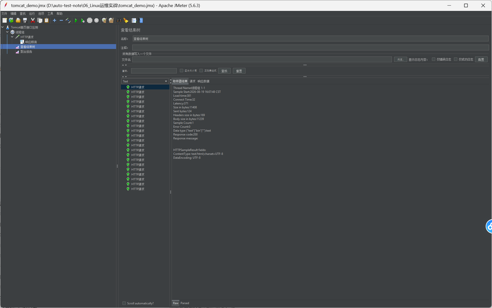
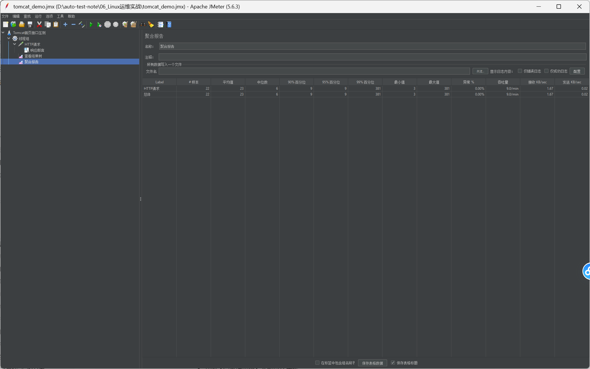

# JMeter 接口压测实操
## 实训目标
掌握 JMeter 基础使用，搭建简单压测脚本，实现多并发压测，看懂聚合报告性能指标，用于面试项目展示。

## 环境准备
1. 工具：Apache JMeter 5.6.3
2. 依赖：JDK8 及以上版本
3. 压测目标：Ubuntu虚拟机 Tomcat 首页
4. 访问地址：http://192.168.86.100:8080/

## 脚本组件搭建步骤
1. **测试计划**：命名为 Tomcat首页接口压测（项目总入口）
2. **线程组**：模拟虚拟并发用户
    - 线程数：10（10个虚拟用户并发）
    - Ramp-Up时间(秒)：3（3秒内逐步拉起所有线程）
    - 循环次数：2（每个用户执行2次请求）
    > 总请求数量 = 10 × 2 = 20 次
3. **HTTP请求**
    - 协议：http
    - 服务器名称或IP：192.168.86.100
    - 端口号：8080
    - 路径：/
4. **响应断言（校验用例是否成功）**
    - 测试字段：响应代码
    - 匹配规则：相等
    - 测试模式：200
    > 作用：判断接口是否正常返回200状态码，失败则标记用例异常
5. **监听器（收集运行结果）**
    - 察看结果树：调试脚本，查看每一条请求详细返回数据
    - 聚合报告：统计压测性能指标，产出压测报告

## 运行实操流程
1. 编写完成脚本后，保存脚本 `tomcat_demo.jmx`
2. 点击顶部绿色启动按钮运行压测
3. 运行完成查看两个监听器结果：
    1）察看结果树：全部绿色对勾，响应码200，代表请求全部成功
    2）聚合报告：统计整体性能数据

## 聚合报告核心指标说明
| 参数 | 含义 |
| ---- | ---- |
| #样本 | 总共发起请求次数 |
| 平均值 | 接口平均响应时间，单位ms |
| 中位数 | 一半请求耗时低于该值 |
| 90%百分位 | 90%的接口请求耗时不超过该数值（性能重点参考） |
| 异常% | 请求失败占比，理想值 0.00% |
| 吞吐量 | 单位时间可处理的请求量（本例：请求/分钟） |

## 实操截图说明
> 将下面两行替换为你实际截图，图片放入 images 文件夹

## 常见问题总结
1. 运行弹窗提示保存脚本：建议保存，方便后续复用脚本
2. 请求报错连接失败：检查虚拟机IP、防火墙端口放行、Tomcat服务是否正常启动
3. 异常百分比不为0：排查网络延迟、服务性能瓶颈

## 学习重点（面试必背）
1. 线程数代表并发虚拟用户，Ramp-Up 避免瞬间大量请求冲击服务
2. 响应断言用于自动化校验接口返回结果
3. 聚合报告是压测核心产出，90%百分位是衡量接口性能关键指标
4. jmx 为 JMeter 脚本文件，可以复用、提交到代码仓库管理