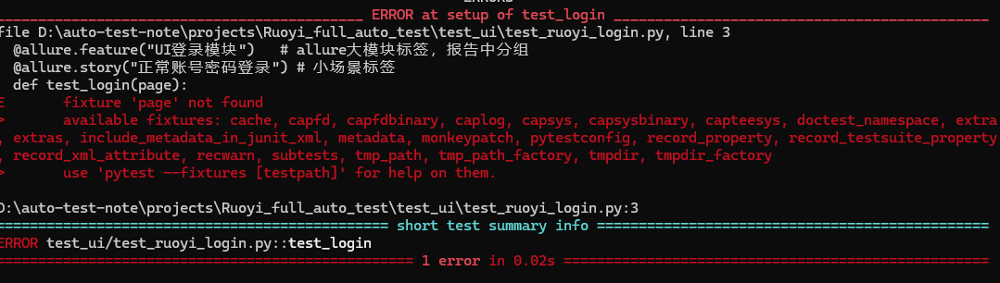
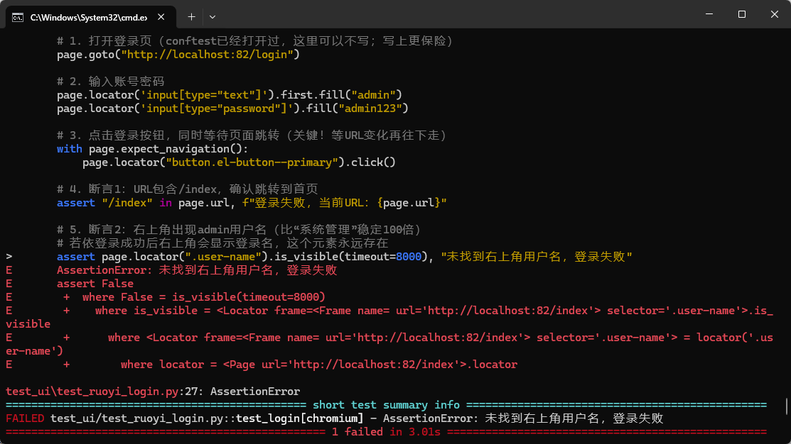
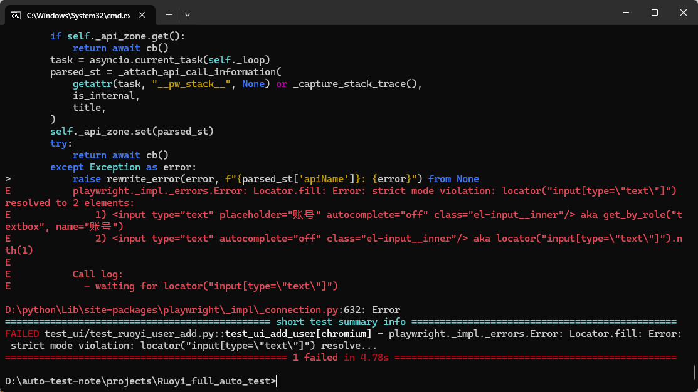
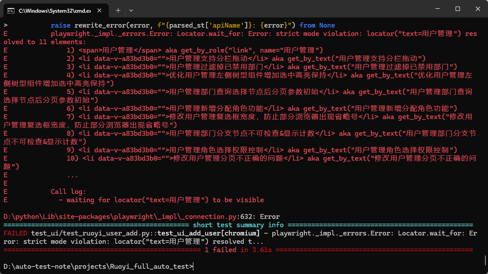
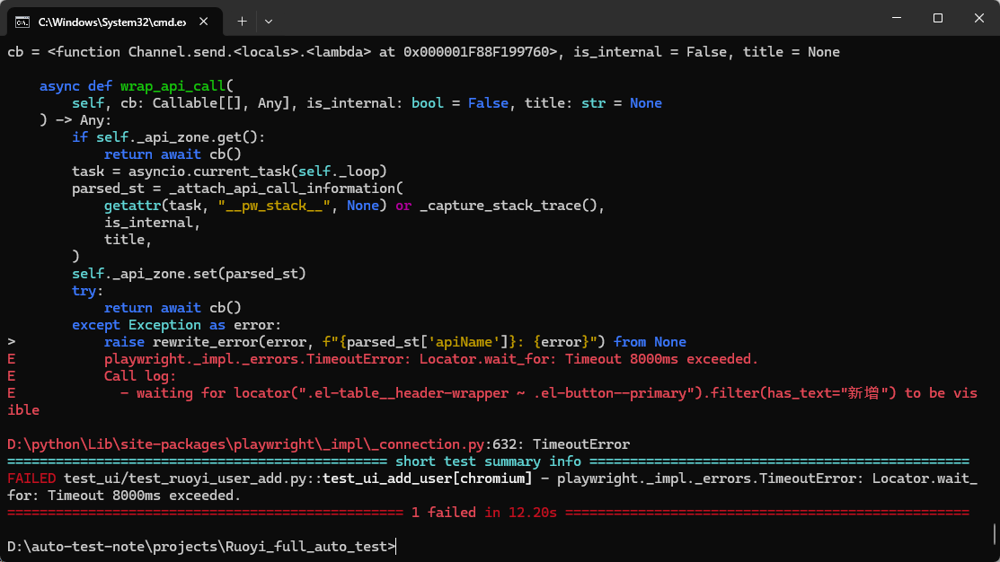
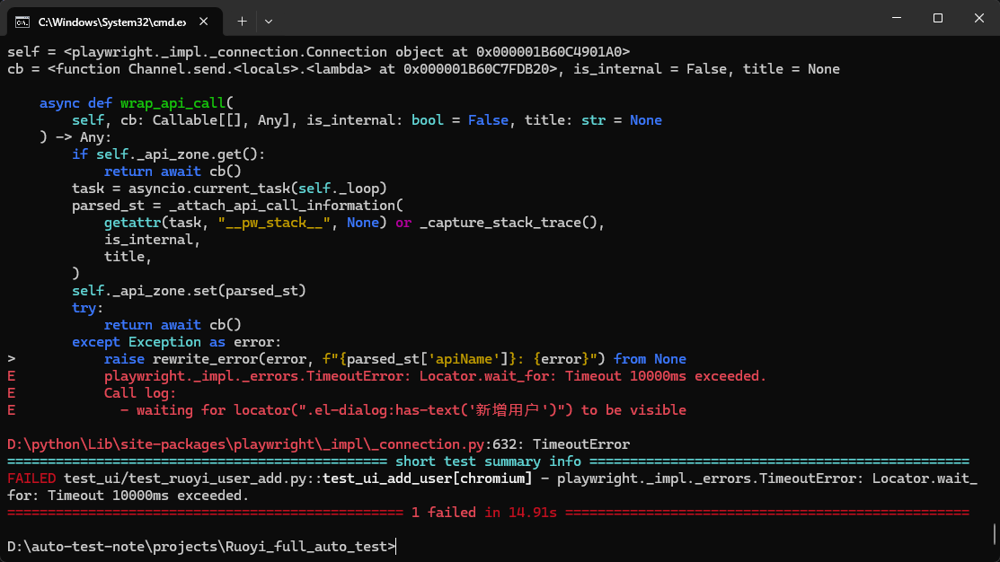
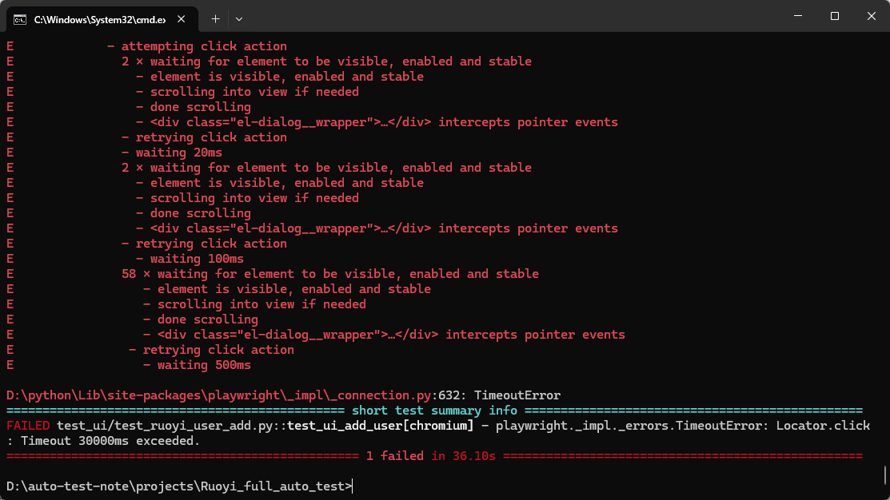
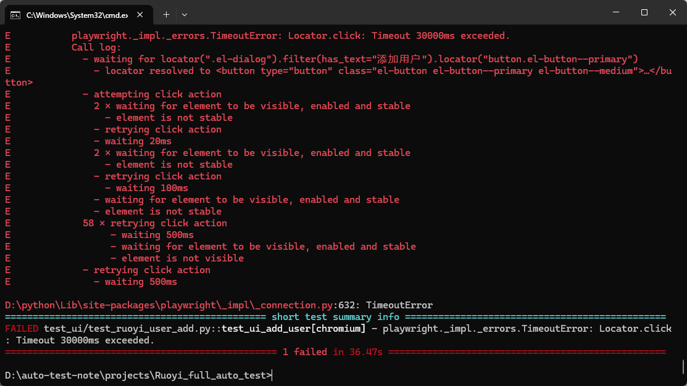

# 08 踩坑记录：从报错到解决方案

本章记录本项目实际遇到的典型问题。排错时不要只记“改哪一行”，要同时记录：现象、原因、验证方法和可迁移的解决原则。

## 1. fixture 找不到：`fixture 'page' not found`

截图：



### 现象

pytest 运行用例时提示：

```text
fixture 'page' not found
```

### 原因

`page` 不是 pytest 内置 fixture，而是 `pytest-playwright` 提供的 fixture。常见原因：

- 没有安装 `pytest-playwright`
- 没有安装 Playwright 浏览器
- 在错误的 Python 环境中执行 pytest
- 测试文件使用了 `page`，但当前环境没有加载插件

### 排查命令

```powershell
python -m pip show pytest-playwright
python -m pip show playwright
pytest --fixtures -q | Select-String page
```

### 解决

```powershell
python -m pip install pytest-playwright playwright
python -m playwright install chromium
```

## 2. 新增成功但列表找不到用户

截图：



### 现象

新增操作看到了成功提示，但搜索后表格中找不到目标用户名。

### 可能原因

1. 搜索按钮没有真正点击
2. 搜索条件没有输入成功
3. 查询结果还没有刷新
4. 用户名被分页隐藏
5. 断言定位器查错了区域
6. 测试数据与搜索数据不一致
7. 新增接口虽然返回成功，但实际数据没有落库

### 排查顺序

```python
print("当前 URL:", page.url)
print("搜索框值:", search_input.input_value())
print("表格文本:", user_page.table.inner_text())
print("匹配数量:", page.get_by_text(username, exact=True).count())
```

然后分别验证：

```text
表单值 → 提交响应 → 成功提示 → 查询请求 → 表格内容
```

### 解决原则

不要只依赖 Toast，要在列表中按唯一用户名查找目标行，并等待表格结果稳定。

## 3. strict mode：一个定位器匹配两个元素

截图：



### 现象

```text
strict mode violation
resolved to 2 elements
```

### 原因

Playwright 默认要求一个操作定位器最终只对应一个元素。页面中可能同时存在隐藏弹窗、多个“确定”按钮或重复菜单文本。

### 错误示例

```python
page.get_by_text("确定").click()
```

### 改进示例

```python
user_page.add_dialog.get_by_role(
    "button", name="确定"
).click()
```

原则：先缩小业务容器，再定位容器内的元素。

## 4. 菜单文本重复匹配

截图：



### 现象

点击“用户”或“系统管理”时，Playwright 报多个元素匹配。

### 解决

```python
page.get_by_text("系统管理", exact=True).click()
page.get_by_text("用户管理", exact=True).click()
```

如果文本仍然重复：

```python
menu = page.locator(".sidebar").get_by_text("用户管理", exact=True)
menu.click()
```

`exact=True` 只能解决文本包含关系，不能解决两个完全相同元素的问题，此时还需要限定父容器或使用更稳定属性。

## 5. 用 `wait_for_timeout` 解决一切问题

截图：



### 问题

```python
page.wait_for_timeout(3000)
page.get_by_role("button", name="新增").click()
```

这只能让问题暂时消失，不能证明页面状态正确。

### 改进

```python
add_button = page.get_by_role("button", name="新增")
add_button.wait_for(state="visible")
add_button.click()
```

如果按钮由接口加载，还应等待用户管理表格或页面标题出现，说明页面已经进入正确业务状态。

## 6. 弹窗等待超时

截图：



### 可能原因

- 新增按钮定位错误
- 按钮被禁用或被遮罩挡住
- 弹窗标题与定位文本不一致
- 点击后发生了前端异常
- 弹窗存在但定位器没有限制 `:visible`

### 排查代码

```python
print("新增按钮数量:", page.get_by_text("新增", exact=True).count())
print("可见弹窗数量:", page.locator(".el-dialog:visible").count())
print("页面文本:", page.locator("body").inner_text()[:1000])
```

### 推荐定位

```python
dialog = page.locator(".el-dialog:visible").filter(
    has_text="添加用户"
).first
expect(dialog).to_be_visible()
```

## 7. 遮罩层阻挡点击

截图：



### 现象

```text
element intercepts pointer events
```

### 原因

页面上存在 loading、弹窗遮罩、消息层或动画层，目标元素虽然在 DOM 中，但用户此时不能点击。

### 处理顺序

1. 等待遮罩消失
2. 等待目标元素可见/可用
3. 检查是否有上一个弹窗没有关闭
4. 检查前一个操作是否触发异常

```python
expect(page.locator(".el-loading-mask")).to_be_hidden()
button.click()
```

不要一开始就使用 `force=True`。强制点击可能绕过真实用户无法点击的状态，反而掩盖产品问题。

## 8. 必填校验断言失败

截图：



### 现象

空表单提交后，测试找不到预期的提示文本。

### 原因

- 断言文本和实际页面文字不一致
- 校验提示是字段级 DOM，不是全局 Toast
- 提交按钮没有真正执行
- 表单没有等待校验渲染

### 排查

```python
print(page.locator(".el-form-item__error").all_inner_texts())
```

### 推荐

根据实际业务结果选择断言：

```python
errors = page.locator(".el-form-item__error:visible")
expect(errors).to_have_count(1)
expect(errors.first).to_contain_text("必填")
```

不要为了让测试通过而随意降低断言强度，应该先确认产品真实提示。

## 9. URL 断言匹配异常

### 现象

页面已经到了首页，但字符串通配匹配行为和预期不一致。

### 改进

```python
import re
from playwright.sync_api import expect

expect(page).to_have_url(re.compile(r"/index(?:\?.*)?/?$"))
```

URL 断言最好同时验证关键页面元素：

```python
expect(page.locator(".user-nickname")).to_be_visible()
```

## 10. 重复用户名误判成功

### 现象

重复用户名用例偶尔被判断为新增成功。

### 原因

页面残留上一次操作产生的成功 Toast，当前测试读到了旧消息。

### 解决

```text
提交当前操作
  → 先判断弹窗状态
  → 再读取当前错误提示
  → 最后查询列表确认数据结果
```

测试不能只依赖一个短暂存在的 Toast。

## 11. Jenkins 找不到项目目录

### 现象

```text
Could not open requirements file: requirements.txt
file or directory not found: test_ui
```

### 原因

Jenkins checkout 到仓库根目录，但项目位于 `Ruoyi_full_auto_test` 子目录。

### 解决

```groovy
dir('Ruoyi_full_auto_test') {
    powershell {
        // 在项目目录中执行 pip 和 pytest
    }
}
```

post action 的报告路径要使用：

```text
Ruoyi_full_auto_test/reports/junit.xml
```

## 12. 排错模板

每次遇到新问题，可以按下面模板记录：

```text
问题现象：
错误信息：
运行命令：
当前 URL：
定位器匹配数量：
页面/接口实际状态：
根本原因：
修复方案：
如何验证：
是否需要补充回归用例：
```