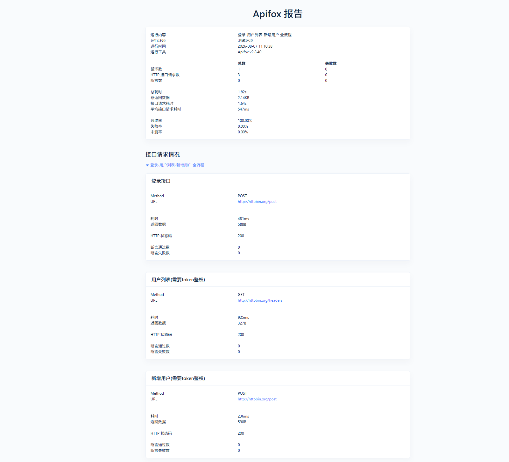

# test-auto-devops-study 运维测试学习仓库
> 秋招运维测试学习笔记、实操用例、接口测试产出归档

## 📝学习笔记
- [软件测试全流程笔记](./软件测试全流程笔记.md)
- [用例设计思路总结](./用例设计思路总结.md)
- [登录注册查询测试用例](./登录注册查询测试用例.md)
- [bug缺陷管理笔记](./bug缺陷管理笔记.md)
- [接口调试记录](./接口调试记录.md)
- [Apifox接口测试操作手册](./Apifox接口测试操作手册.md)
- [Apifox接口进阶](./Apifox接口进阶.md)

## 🧪接口自动化测试产出
### Apifox自动化测试报告
> ⚠️ GitHub不会渲染HTML网页文件，请下载 `apifox_report/apifox‑接口自动化测试报告.html`，本地浏览器双击打开查看完整报告。

报告预览截图：

文件路径：`apifox_report/apifox‑接口自动化测试报告.html`